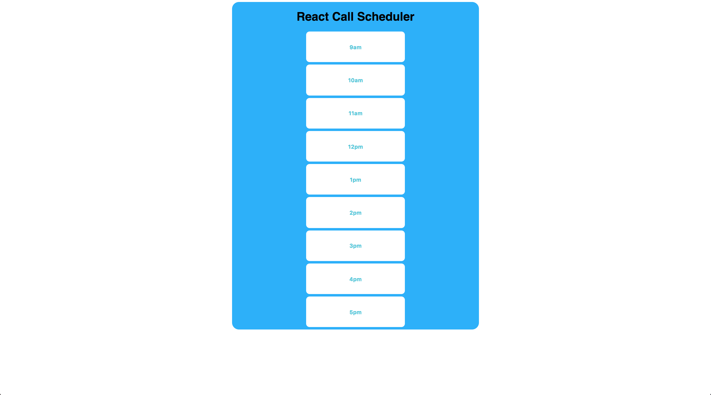
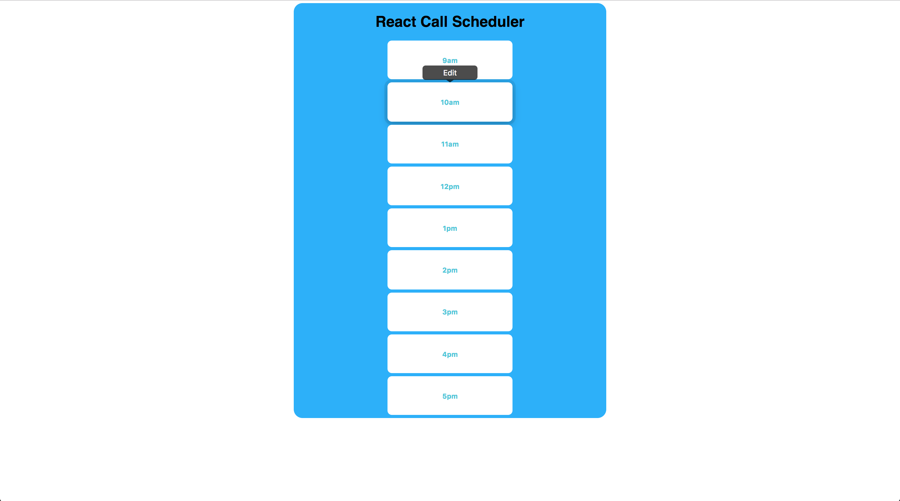
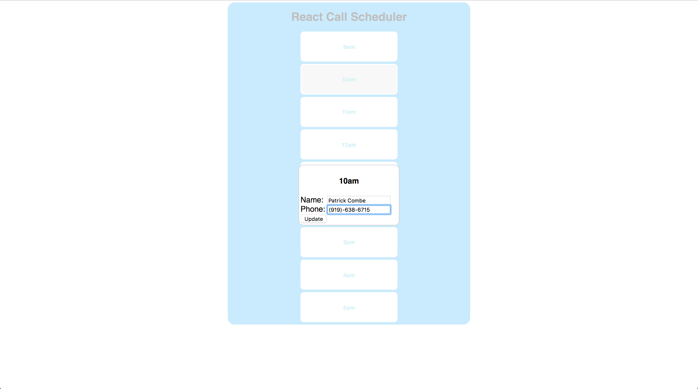
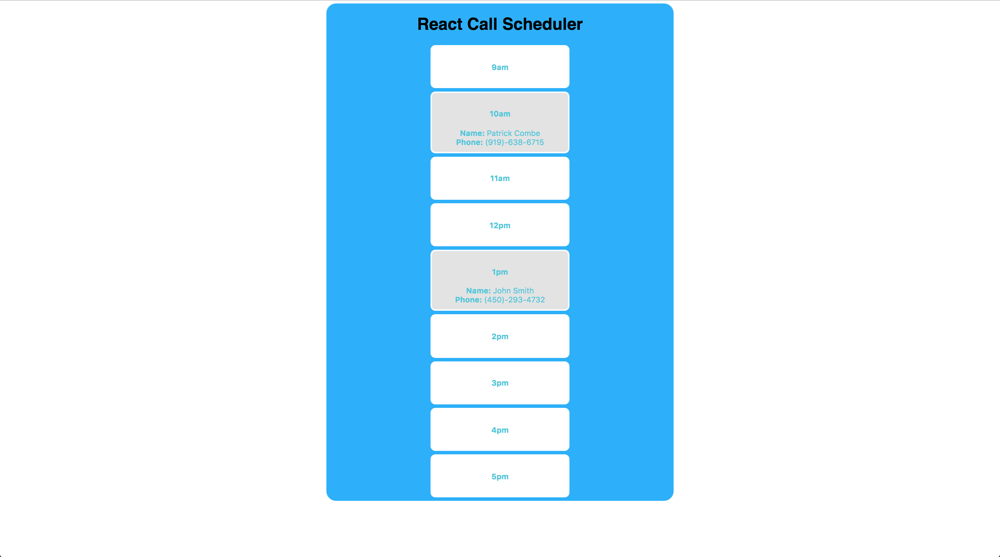

# React Scheduler

Ths project implements an interactive phone call scheduler using React. It displays a single day's worth of schedulable one-hour time slots, from 9am to 5pm. When clicking any time slot, the user is able to enter a name and phone number of the person with whom they are scheduling a phone call during that time slot.

## Screenshots

### Front page

### Hovering

### Adding a call

### Front page with scheduled calls

